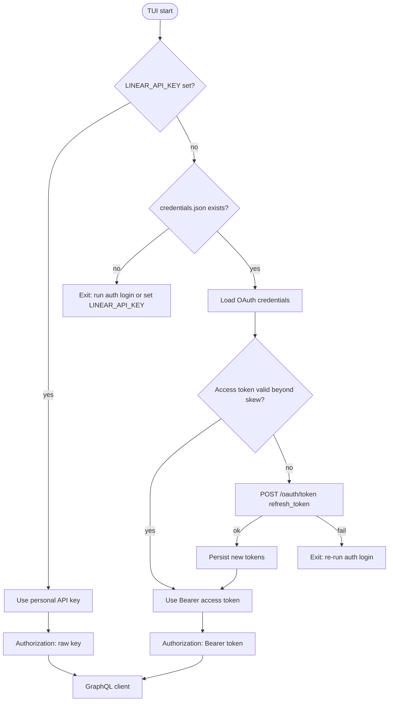
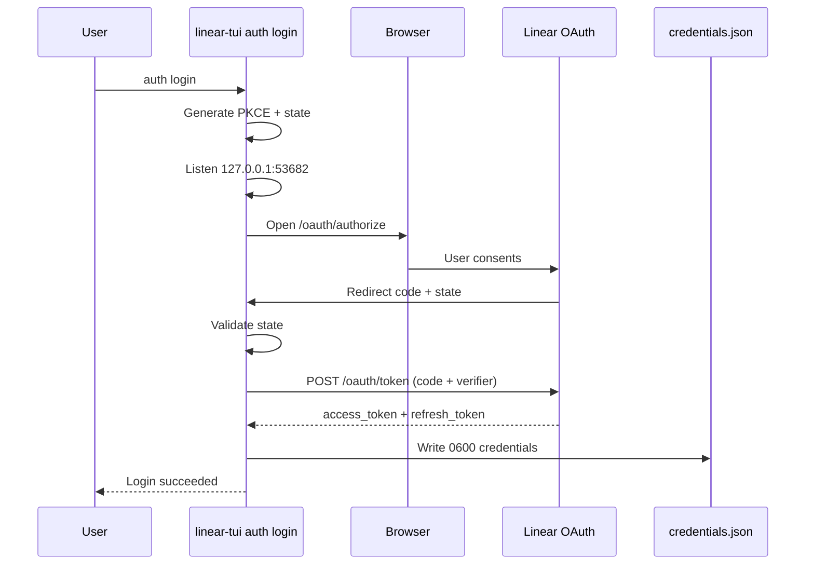
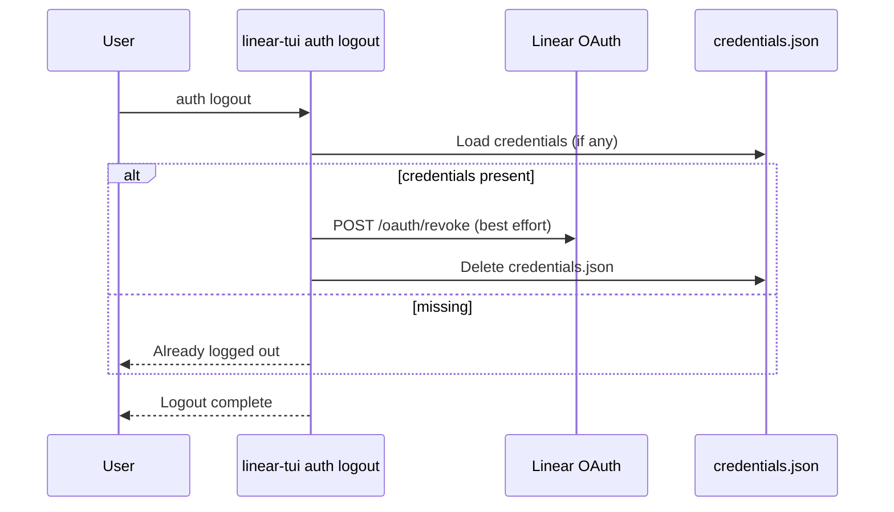
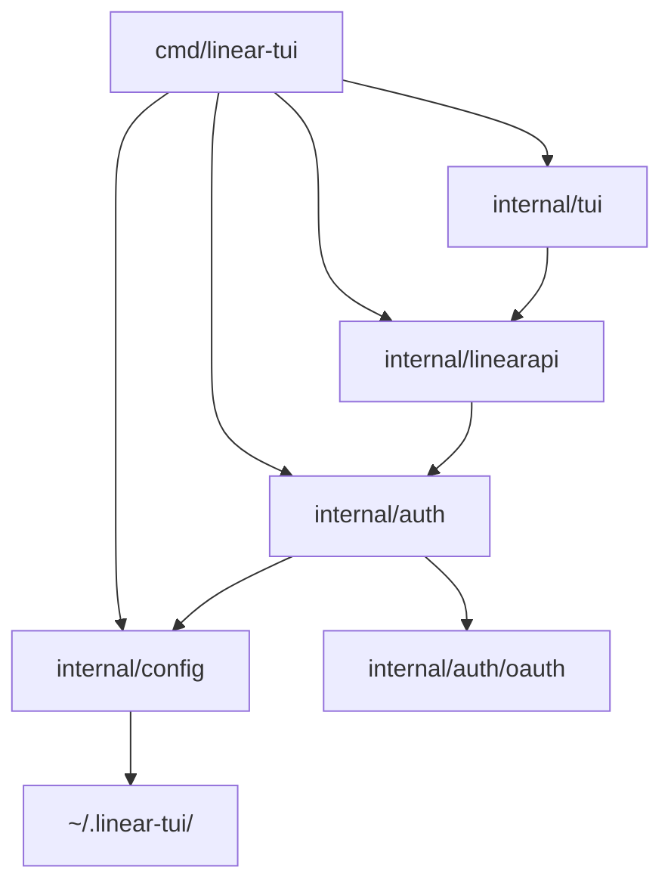

# OAuth Login Implementation

## Overview

Implement browser-based Linear OAuth 2.0 with PKCE so users can authenticate without manually creating a personal API key ([issue #12](https://github.com/roeyazroel/linear-tui/issues/12)).

**Commands:**
- `linear-tui auth login` — open Linear in the browser, complete OAuth authorization, store credentials
- `linear-tui auth logout` — revoke (best-effort) and delete stored credentials

**Constraints:**
- Keep `LINEAR_API_KEY` as a hard override when set
- Prefer stored OAuth credentials when the env key is absent
- Access tokens expire (~24h); refresh automatically using the stored refresh token
- Pattern: **Non-TDD** (architecture and Linear OAuth contract first; tests follow)

## Architecture

### Auth resolution order (TUI startup)

1. If `LINEAR_API_KEY` is set → use it as a personal API key (raw `Authorization` header).
2. Else if stored OAuth credentials exist → ensure a valid access token (refresh if expired/near expiry), then use `Authorization: Bearer <access_token>`.
3. Else → fail with guidance to run `linear-tui auth login` or set `LINEAR_API_KEY`.

### New packages / modules

| Module | Responsibility |
| --- | --- |
| `internal/auth` | Credential store, PKCE helpers, login/logout orchestration, token refresh |
| `internal/auth/oauth` | Linear authorize/token/revoke HTTP client (no TUI coupling) |
| `cmd/linear-tui` | Subcommand routing for `auth login` / `auth logout` before TUI boot |
| `internal/config` | Resolve auth token without requiring env key when OAuth creds exist |
| `internal/linearapi` | Dual auth header modes: API key (raw) vs OAuth (`Bearer`) |

### OAuth app / client identity

- Maintainers create a Linear OAuth application for `linear-tui` (public client).
- Embed a compile-time / constant `ClientID` in `internal/auth/oauth` (public by design for PKCE).
- Allow override via `LINEAR_CLIENT_ID` for forks/dev.
- Fixed loopback redirect: `http://127.0.0.1:53682/callback` (must be registered on the OAuth app).
- Scopes: `read,write` (covers current TUI read/write operations).
- Actor: `user` (default).
- No `client_secret` required for PKCE token exchange/refresh.

### Credential storage

- Path: `~/.linear-tui/credentials.json` (alongside existing `config.json`).
- File mode: `0600`; directory already `0755` under `~/.linear-tui`.
- Contents (JSON): `access_token`, `refresh_token`, `token_type`, `expires_at` (absolute UTC), `scope`, `updated_at`.
- Never write tokens into `config.json` or logs.
- Logout deletes the credentials file after best-effort revoke.

### Login flow (CLI)

1. Bind loopback listener on `127.0.0.1:53682`.
2. Generate PKCE verifier/challenge (S256) and CSRF `state`.
3. Open browser to `https://linear.app/oauth/authorize` with required query params.
4. Wait for callback (timeout ~5 minutes); validate `state`; extract `code`.
5. Exchange code at `POST https://api.linear.app/oauth/token`.
6. Persist tokens; print success; exit 0.
7. On cancel/timeout/error: print actionable error; exit non-zero; leave prior credentials untouched.

### Runtime token use (TUI)

- On client construction, if OAuth mode: refresh when `expires_at` is within a skew window (e.g. 5 minutes).
- Optionally refresh on GraphQL `401` once, then retry once.
- Persist rotated refresh/access tokens after successful refresh (Linear returns a new refresh token).

### Logout flow

1. Load credentials if present.
2. Best-effort `POST https://api.linear.app/oauth/revoke` with `token` (+ optional `token_type_hint`).
3. Delete credentials file even if revoke fails (local logout must succeed).
4. Print status.

### Explicit non-goals (this plan)

- Device-code flow for headless/SSH environments
- OS keychain integration
- In-TUI login UI
- Changing agent provider auth

## Mermaid Diagrams

### Auth resolution and API header mode



### Login sequence



### Logout sequence



### Package dependency graph



## Code Plan

### Constants / config contracts

```go
// internal/auth/oauth/constants.go (signatures / values)
const (
  AuthorizeURL   = "https://linear.app/oauth/authorize"
  TokenURL       = "https://api.linear.app/oauth/token"
  RevokeURL      = "https://api.linear.app/oauth/revoke"
  DefaultClientID = "ea40a3da4d4511d43a97ce7691dc315d"
  RedirectHost   = "127.0.0.1"
  RedirectPort   = 53682
  RedirectPath   = "/callback"
  DefaultScopes  = "read,write"
  LoginTimeout   = 5 * time.Minute
  RefreshSkew    = 5 * time.Minute
)
```

Env overrides:
- `LINEAR_API_KEY` — existing override
- `LINEAR_CLIENT_ID` — OAuth client id override for forks/dev

### Types

```go
// internal/auth/credentials.go
type Credentials struct {
  AccessToken  string    `json:"access_token"`
  RefreshToken string    `json:"refresh_token"`
  TokenType    string    `json:"token_type"`
  Scope        string    `json:"scope"`
  ExpiresAt    time.Time `json:"expires_at"`
  UpdatedAt    time.Time `json:"updated_at"`
}

type TokenSource string // "api_key" | "oauth"

type ResolvedAuth struct {
  Token      string
  Source     TokenSource
  ExpiresAt  *time.Time // nil for API key
}
```

```go
// internal/auth/oauth/client.go
type TokenResponse struct {
  AccessToken  string `json:"access_token"`
  TokenType    string `json:"token_type"`
  ExpiresIn    int    `json:"expires_in"`
  Scope        string `json:"scope"`
  RefreshToken string `json:"refresh_token"`
}

type Client struct { /* HTTP client, clientID */ }

func (c *Client) ExchangeCode(ctx, code, redirectURI, verifier) (TokenResponse, error)
func (c *Client) Refresh(ctx, refreshToken) (TokenResponse, error)
func (c *Client) Revoke(ctx, token, hint) error
```

### Function signatures (core)

```go
// internal/auth/pkce.go
func GeneratePKCE() (verifier, challenge string, err error)
func GenerateState() (string, error)

// internal/auth/store.go
func CredentialsPath() (string, error)
func LoadCredentials(path string) (Credentials, error)
func SaveCredentials(path string, creds Credentials) error
func DeleteCredentials(path string) error

// internal/auth/resolve.go
func Resolve(ctx context.Context, apiKeyEnv string, storePath string, oauthClient *oauth.Client) (ResolvedAuth, error)
func EnsureAccessToken(ctx context.Context, creds Credentials, oauthClient *oauth.Client, now time.Time, skew time.Duration) (Credentials, error)

// internal/auth/login.go
func Login(ctx context.Context, opts LoginOptions) error
// LoginOptions: ClientID, RedirectURL, Scopes, OpenBrowser func, ListenAndServe callback, StorePath, HTTP client

// internal/auth/logout.go
func Logout(ctx context.Context, opts LogoutOptions) error
```

### PKCE generation (pseudo)

```
verifier = base64url(32 random bytes)
challenge = base64url(SHA256(verifier))
state = base64url(16 random bytes)
```

### Login callback server (pseudo)

```
ln, err := net.Listen("tcp", "127.0.0.1:53682")
openBrowser(authorizeURL)
select:
  case callback code/state within LoginTimeout:
    validate state; exchange; save
  case ctx.Done / timeout:
    return error
shutdown listener
```

### CLI routing changes (`cmd/linear-tui/main.go`)

```
args := os.Args[1:]
switch:
  case --version / -v: print version
  case auth login: run auth.Login; exit
  case auth logout: run auth.Logout; exit
  case auth / auth --help: print auth usage; exit
  default: existing TUI boot with Resolve(...) instead of env-only key
```

No new CLI framework dependency (keep manual argv parsing consistent with current `--version`).

### `internal/config` changes

- `ConfigFromSettings(apiKey string, ...)` becomes tolerant of empty `apiKey` **only when** caller already resolved a token; prefer a new entrypoint:

```go
func ConfigFromSettingsWithToken(token string, settings Settings) (Config, error)
// or keep LinearAPIKey field but rename semantically to AuthToken in comments only
// (avoid broad renames; keep field name LinearAPIKey for minimal churn, document it may hold OAuth access token)
```

- Startup in `main`: `resolved, err := auth.Resolve(...)` then `ConfigFromSettings(resolved.Token, settings)`.

### `internal/linearapi` changes

```go
type ClientConfig struct {
  Token      string
  TokenSource auth.TokenSource // or bool UseBearer
  ...
}

// authTransport.RoundTrip:
if UseBearer {
  req.Header.Set("Authorization", "Bearer "+t.Token)
} else {
  req.Header.Set("Authorization", t.Token)
}
```

Optional: inject a refresh hook / mutable token on the transport for mid-session expiry. Minimum viable: refresh once at startup via `auth.Resolve`; document that sessions longer than remaining token lifetime may need restart unless 401-retry is implemented in the same PR.

**Decision for this plan:** implement startup refresh + single 401 refresh-and-retry in `authTransport` or GraphQL wrapper so long TUI sessions remain usable.

### Browser open helper

```go
// internal/auth/browser.go
func OpenURL(url string) error
// use OS-specific commands: xdg-open / open / rundll32; allow LoginOptions.OpenBrowser override for tests
```

### Docs / README updates (same PR as implementation)

- Requirements: OAuth login **or** `LINEAR_API_KEY`
- Usage: `linear-tui auth login`, `linear-tui auth logout`
- Note: API key still overrides stored OAuth
- Maintainer note: register redirect `http://127.0.0.1:53682/callback` and set `DefaultClientID`

### Maintainer prerequisite (blocking for end-to-end)

Create Linear OAuth app with:
- Name: `linear-tui` (or similar)
- Callback URL: `http://127.0.0.1:53682/callback`
- Refresh tokens enabled (default for new apps)
- Public client / PKCE

Until `DefaultClientID` is set, login must error with clear instructions to set `LINEAR_CLIENT_ID` or wait for the published client id.

## Test Plan

### Unit tests

| Area | Cases |
| --- | --- |
| PKCE | Verifier length/charset; challenge is S256 of verifier; uniqueness |
| State | Non-empty, URL-safe, unique |
| Credentials store | Save/load round-trip; file mode `0600`; delete idempotent; corrupt JSON errors |
| Resolve | API key wins over OAuth; OAuth used when env empty; missing both errors; refresh called when near expiry; refresh failure surfaces error |
| OAuth HTTP client | Exchange/refresh/revoke request shape (form body, Content-Type); success JSON parse; error status mapping |
| Auth header | API key → raw header; OAuth → `Bearer ` prefix |
| CLI argv | `auth login` / `auth logout` / unknown auth subcommand usage paths (table-driven via extracted `run(args)` if needed) |

### Integration-style tests (httptest)

| Flow | Approach |
| --- | --- |
| Login happy path | Fake authorize is skipped; local callback injected via test server or direct `ExchangeCode`; assert store written |
| Login state mismatch | Callback with wrong state → error, store unchanged |
| Login timeout | Short timeout, no callback → error |
| Refresh rotation | Mock token endpoint returns new refresh; assert persisted |
| Logout | Mock revoke; assert file removed even when revoke returns 400 |
| 401 retry | Mock GraphQL 401 then 200 after refresh |

### Manual verification

1. `LINEAR_CLIENT_ID` set (or embedded id) → `auth login` opens browser → consent → credentials file created mode `0600`.
2. Unset `LINEAR_API_KEY` → `linear-tui` starts and loads issues.
3. Set `LINEAR_API_KEY` with invalid OAuth file present → API key path used.
4. `auth logout` → revoke + file gone → TUI refuses to start without key.
5. Force near-expiry credentials → next start refreshes without browser.

### Out of scope for automated CI

- Real Linear browser consent
- Real OAuth app registration

## Tasks

### Completed

- [x] Research issue #12 and Linear OAuth PKCE docs
- [x] Map current env-only auth path (`main`, `config`, `linearapi.authTransport`)
- [x] Write this plan (Non-TDD)
- [x] Approve plan / set `DefaultClientID` (`ea40a3da4d4511d43a97ce7691dc315d`)
- [x] Add `internal/auth/oauth` token client (exchange, refresh, revoke) + tests
- [x] Add PKCE/state helpers + credentials store (`0600`) + tests
- [x] Implement `Login` loopback server + browser open + timeout
- [x] Implement `Logout` revoke-best-effort + delete store
- [x] Wire `auth login` / `auth logout` in `cmd/linear-tui`
- [x] Change startup auth resolution: env override → OAuth store → clear error
- [x] Update `linearapi` auth transport for Bearer vs raw + 401 refresh-once
- [x] Update README / CONTRIBUTING auth docs
- [x] Embed `DefaultClientID` / document `LINEAR_CLIENT_ID`
- [x] Run `go test ./...`

### In Progress

### Future

- [ ] Manual end-to-end browser login against Linear OAuth app redirect URI
- [ ] Optional device-code flow for headless/SSH environments

## Relevant Files

| File | Change |
| --- | --- |
| `.docs/oauth-login.md` | This plan (contract for EXECUTE) |
| `cmd/linear-tui/main.go` | Subcommands + resolved auth startup |
| `internal/auth/*.go` | New: login, logout, resolve, store, pkce, browser |
| `internal/auth/oauth/*.go` | New: Linear OAuth HTTP API |
| `internal/auth/*_test.go` | Unit/integration tests |
| `internal/config/settings.go` | Allow empty env key when token resolved upstream (as needed) |
| `internal/config/config.go` | Docs / helpers for auth token resolution |
| `internal/linearapi/client.go` | Bearer vs raw Authorization; optional 401 refresh |
| `internal/linearapi/client_test.go` | Header mode + refresh retry tests |
| `README.md` | Auth login usage; API key override |
| `CONTRIBUTING.md` | Dev auth setup |

## Approval Gate

Plan approved with embedded `DefaultClientID=ea40a3da4d4511d43a97ce7691dc315d`. EXECUTE complete pending manual browser verification that the OAuth app callback is registered as `http://127.0.0.1:53682/callback`.
