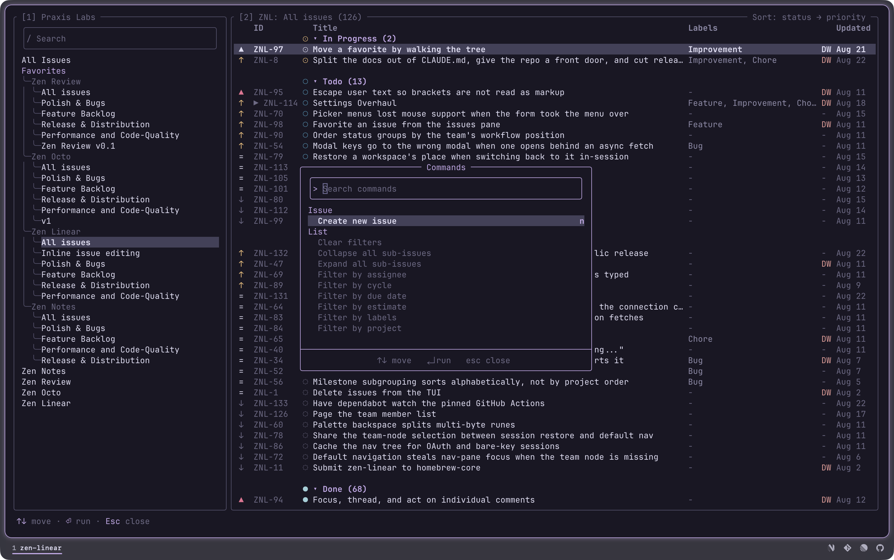
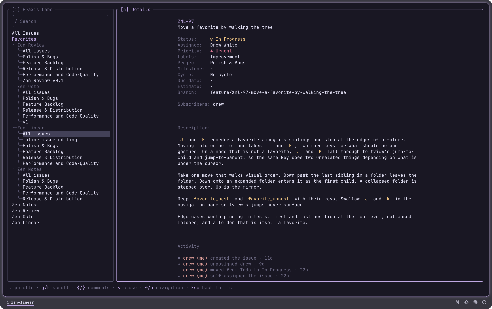
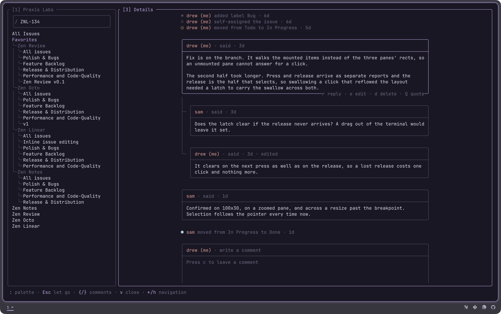

# zen-linear

A terminal client for Linear, for people who work their issues from a keyboard
and would rather not leave the terminal to do it.

Your Linear sidebar is the navigation tree, favorites and all. The issue list
groups, sorts and filters the way the web app does. The details pane is one
scrolling page: the issue, its description, its comments. Every field on it is
editable in place, saving as you go.

It is an unofficial third-party client built on Linear's public API, and it is
not affiliated with Linear.


Left to right: where you are, what is there, and the issue you are on. Each
pane's number is in its title, and typing that number focuses it.

## Install

```sh
curl -fsSL https://raw.githubusercontent.com/praxis-labs-io/zen-linear/main/install.sh | sh
```

Downloads the binary for macOS or Linux, on arm64 or amd64. Windows takes the
`.zip` off the
[releases page](https://github.com/praxis-labs-io/zen-linear/releases), the
installer being a POSIX script. On anything else:

```sh
go install github.com/praxis-labs-io/zen-linear/cmd/zen-linear@latest
```

Or from a clone, which is what you want if you intend to change anything:

```sh
git clone https://github.com/praxis-labs-io/zen-linear.git
cd zen-linear
make install
```

The installer and `make install` both put the binary in `~/.local/bin`, and
`INSTALL_DIR` moves it. There is no Homebrew tap.
[docs/install.md](docs/install.md) has the requirements, the PATH setup and how
to upgrade.

## A first run

```sh
zen-linear auth login
zen-linear
```

`auth login` opens Linear in a browser. If you would rather use an API key, or
run more than one workspace, [docs/install.md](docs/install.md) covers both.

Three keys carry most of it. `?` lists every key that works where you are, and
it is context-aware rather than one long sheet. `:` opens the command palette,
which lists only what applies to the pane you opened it from. `e` puts the
details pane in edit mode, where `j`/`k` walk the issue's fields and Enter
opens the one you are on.

After that: `h`/`l` move between panes, `/` searches the workspace, `c` writes
a comment, `n` makes an issue.

## A look around

`:` opens the command palette. It lists only what applies to the pane you
opened it from, so the same key gives you issue commands from the list and
favorites commands from the tree.



`v` zooms the details pane over the list. The issue is one scrolling page:
metadata at the top, the description as rendered markdown, then the activity
and the conversation. Every field in that header is editable in place.



Comments are threaded, and the issue's history is folded into the same stream
by time, so a status move sits where it happened rather than in a separate tab.
`{` and `}` step between the cards. A picked card names the keys that act on
the conversation along its own bottom border, and edit and delete are offered
on your own comments only. The box to write in is always at the end of the
page.



## Documentation

- [Guide](docs/guide.md) — the panes, favorites, grouping and sorting, the
  details page, what is kept between runs
- [Keys](docs/keys.md) — every key, by what you are doing
- [Configuration](docs/configuration.md) — `config.json`, themes, columns,
  workspaces, keybindings
- [Install](docs/install.md) — requirements, authenticating, PATH, upgrading
- [Agents](docs/agents.md) — handing an issue to a terminal coding agent
- [Contributing](docs/CONTRIBUTING.md) — building, testing and the conventions

## Acknowledgments

zen-linear began as a fork of
[linear-tui](https://github.com/roeyazroel/linear-tui) by
[@roeyazroel](https://github.com/roeyazroel), who built the foundation it still
runs on: the Linear API client, OAuth, the pane layout and the agent
integration. It has been developed independently since August 2026, and the MIT
copyright is held jointly in [LICENSE](LICENSE).

Themed with [Rose Pine](https://rosepinetheme.com). Rendered by
[tview](https://github.com/rivo/tview) and
[glamour](https://github.com/charmbracelet/glamour).

## License

MIT, held jointly by Drew White and Roey Azroel. See [LICENSE](LICENSE).
