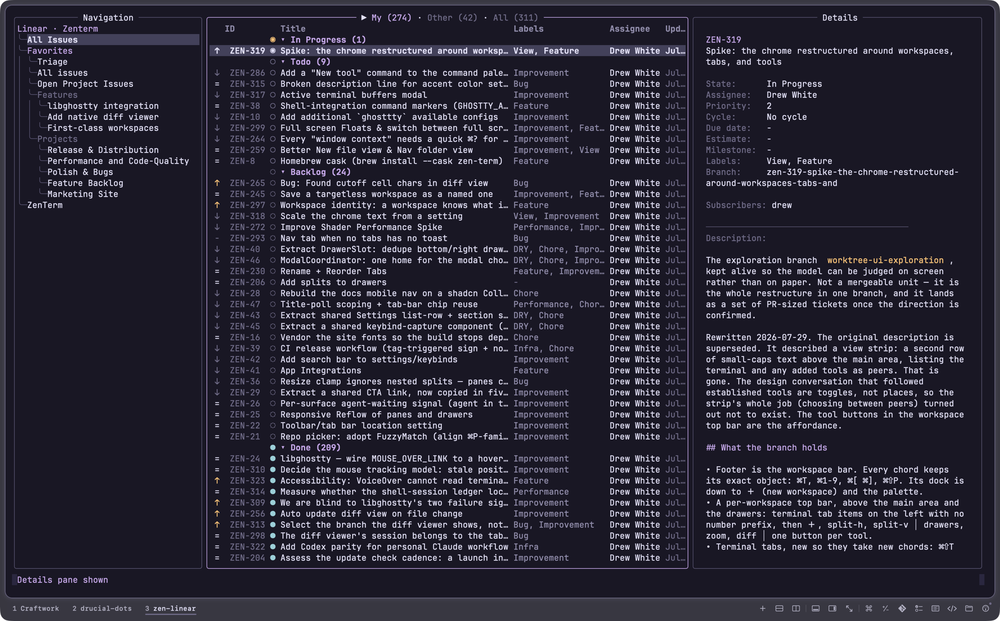
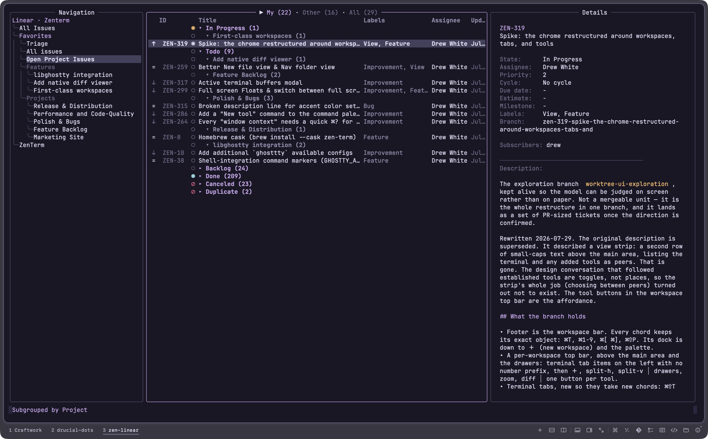
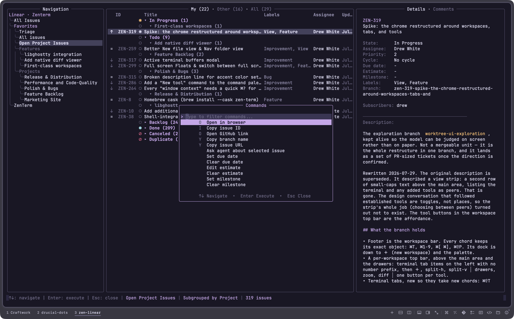

# zen-linear

A terminal interface for Linear, built with Go and tview.

zen-linear is an opinionated fork of
[linear-tui](https://github.com/roeyazroel/linear-tui) by
[@roeyazroel](https://github.com/roeyazroel), who built the foundation this
runs on: the Linear API client, OAuth, the pane layout, and the agent
integration. Fixes and features are offered upstream where they fit.

## Screenshots

## Features

Navigation
- Favorites matching the Linear sidebar: projects, issues, cycles, teams,
  custom views, triage, folders
- Teams with cycles, statuses, and projects
- Workspace switching with per-workspace API keys and a default workspace

Issues
- Linear-style columns, configurable order and visibility
- Grouping and subgrouping by status, priority, assignee, cycle, project, or
  milestone, with collapsible headers
- My, Other, and All tabs with lazygit-style tab strips
- Sort by updated, created, priority, or status
- Details drawer with themed markdown, comments, attachments, and branch name

Interaction
- Context-aware command palette with fuzzy search and number shortcuts
- Configurable keybindings
- Pane toggles and a responsive layout on narrow terminals
- Copy issue ID, URL, or branch name. Open the issue or its GitHub link

Appearance
- Rose Pine Moon theme with a transparent background, plus the original
  linear, high contrast, and color blind themes
- Optional rounded borders
- Theme-derived selection, markdown, and modal styling

## Install

Requires Go 1.24 or later.

    git clone https://github.com/Drucial/zen-linear.git
    cd zen-linear
    go build -o ~/.local/bin/linear-tui ./cmd/linear-tui

Authenticate with `linear-tui auth login`, or set per-workspace API keys as
described below.

## Configuration

Settings live in `~/.linear-tui/config.json`, created on first start. The
options added by this fork:

    {
      "theme": "rose_pine_moon",
      "rounded_borders": true,
      "group_by": "status",
      "subgroup_by": "",
      "sort_by": ["status", "priority"],
      "columns": ["priority", "id", "state", "title", "labels", "assignee", "updated"],
      "default_workspace": "Work",
      "workspaces": [
        { "name": "Work", "api_key_env": "LINEAR_API_KEY_WORK" },
        { "name": "Personal", "api_key_env": "LINEAR_API_KEY_PERSONAL" }
      ],
      "keybindings": {
        "switch_workspace": "w",
        "copy_branch": "Y"
      }
    }

- `columns` selects and orders the issue list from: priority, id, state,
  title, labels, assignee, updated, cycle, due, estimate, milestone
- `group_by` and `subgroup_by` take status, priority, assignee, cycle,
  project, or milestone
- `sort_by` takes status, priority, updated, or created. Order matters: the
  first field decides, the rest break ties. Omit it to sort by most recently
  updated
- `workspaces` reads keys from the named env vars. Keys are never stored in
  the file
- `keybindings` remaps palette commands by id, the global quit, open_palette,
  and search actions, and the tab_next, tab_prev, columns_left, and
  columns_right actions

## Keys

    j/k         move            Enter       toggle details
    h/l, Tab    switch panes    Space       expand sub-issues
    { }         toggle panes    [ ]         cycle issue tabs*
    H/L         scroll columns  :           command palette
    /           search          q           quit

*Defaults shown reflect this fork's example config; stock defaults keep
[ ] on expand and collapse all.

## Credits

Built on [roeyazroel/linear-tui](https://github.com/roeyazroel/linear-tui).
Themed with [Rose Pine](https://rosepinetheme.com). Rendered by
[tview](https://github.com/rivo/tview) and
[glamour](https://github.com/charmbracelet/glamour).
