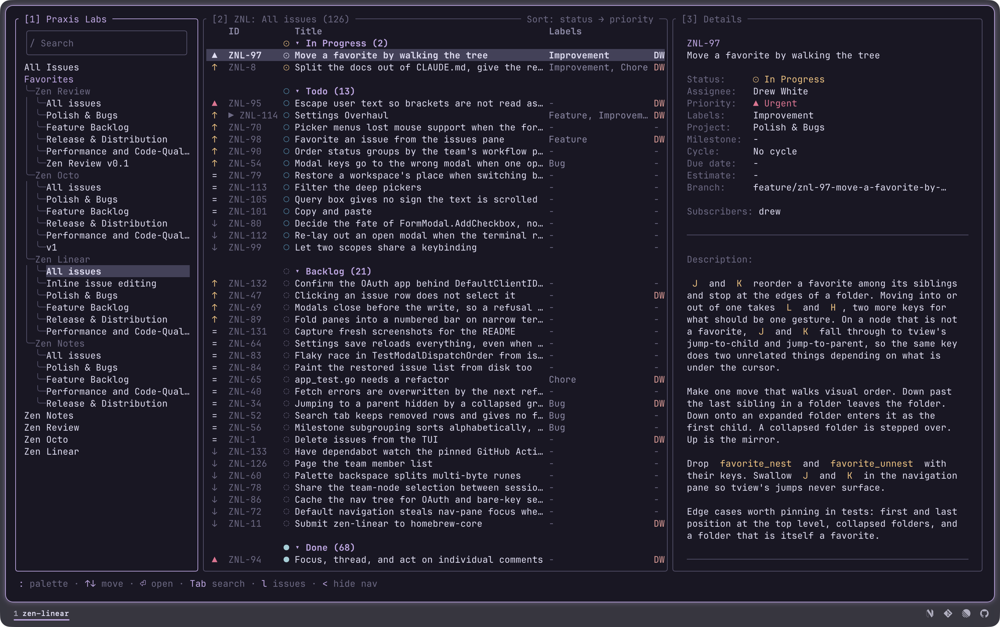

# Guide

zen-linear is a terminal client for Linear. It is built for people who work
their issues from a keyboard and would rather not leave the terminal to do it.

Everything it shows comes from Linear's API, and everything it changes is
written straight back, so the web app and this stay in step. There is no local
model of your workspace to fall out of date.

## The three panes

Left to right: where you are, what is there, and the issue you are on.

Each pane's title carries its number, and typing that number focuses the pane,
including when it has been toggled off. Pane 1 is titled with the workspace you
are in, and pane 2 with the scope the list is showing and how many issues are
in it.

`h` and `l` step between the panes, `<` and `>` hide the outer two, and `v`
zooms the details pane over the issue list.

On a narrow terminal the layout collapses to fewer panes and the numbers still
work.

## Navigation

The tree is the Linear sidebar, in three sections with a blank row between
them: All Issues, then **Favorites** in the order you keep them there, then
**Teams**. The two headings are labels rather than rows, so the cursor steps
over them, and a section with nothing in it is left out.

### Favorites

Projects, issues, cycles, teams, custom views, triage and folders all appear as
you favorited them. `F` favorites or unfavorites whatever the cursor is on.
`J` and `K` move a favorite through the tree as it is drawn: onto an open
folder steps into it, off the end of a folder steps back out, and a closed
folder is stepped over. A folder itself moves whole, over its neighbour
rather than into it, since Linear has no folder inside a folder. Each of
those writes to Linear.

A favorited project lists every team's issues. The favorite is the project, not
one team's slice of it, so a project shared across teams shows the whole of it.

### Teams

A team expands into three headings — Cycles, Status and Projects — each folded,
since a team that opened onto all of them at once is more rows than the pane
has. `⏎` opens one, and the `▸` and `▾` on a row say which way it goes. Selecting
anything inside scopes the issue list to it.

### Search

`/` puts the cursor in the query box at the top of the pane. The search is
**workspace-wide**: it deliberately ignores the tree's scope, the filters and
the sort chain, because a search that quietly inherited them would answer a
question you did not ask. Results replace the issue list until the query is
cleared.

## The issue list

Columns are configurable in order and visibility, and default to what Linear's
own list view shows: priority, id, state, title, labels, assignee, updated.
Cycle, due, estimate, project and milestone are available too. See
[configuration.md](configuration.md).

### Grouping

Issues group by status, priority, assignee, cycle, project or milestone, and
subgroup by a second one of those. Group headers are rows in the same list, and
Enter, Space or a click collapses one.

### Sorting

`sort_by` is a chain of fields. The first entry decides and the rest break
ties, so `["status", "priority"]` reads as status order with the most urgent
first inside each. The palette changes it live.

### Filters

The palette holds the rich filters: assignee, labels, status, project, cycle,
due date, estimate. They combine, and the pane's top border says what is
applied, so you can see the list is filtered.

## The details page

The details pane is **one scrolling page**. The issue's
metadata, its description rendered as markdown, then the activity and comments
in one stream, and a box to write in at the end.

`{` and `}` step through the comment cards; `j` and `k` keep scrolling. Nothing
is picked out until a brace says so, and Esc lets go again. A picked card takes
keys of its own for as long as it holds them.

### Comments

Replies nest under the comment they answer, and replying opens a box inside
that thread rather than at the foot of the page, so the answer is written where
it is going to appear. A box grows with what is written in it. Esc closes
one and keeps the words for next time.

Editing turns a card into a box in the place it stood. Deleting asks first, and
replies stay when the comment they answered goes.

Activity, a status move or an assignment or a label, is folded into the same
stream by time, so the conversation reads in order.

### Editing an issue in place

`e` puts the pane in edit mode. A cursor walks the metadata rows, and Enter
opens that field's options in a list under it, on the value the issue already
holds.

Seven fields open a list: team, state, assignee, priority, project, milestone,
cycle. Labels opens the same list as a multi-select. Title, due date and
estimate are typed in the row itself, where the value already is. The
description is typed in the rows it reads in, with the markdown going raw as
the cue.

Each field saves on its own, so leaving the pane loses nothing.

Options load for the team that owns the issue. Linear refuses a state or a label from another team, so a
search result or a cross-team favorite offering the tree's options would be a
write that fails. Team is the exception, listing the whole workspace: moving
the issue is what that row is for, and it renumbers the issue.

The full keymap is in [keys.md](keys.md).

## Creating issues

`n` opens the create form. Team is its first field, seeded from wherever you
are in the tree and changeable: every field under it belongs to one team, so
changing it reloads them and drops the picks that no longer apply. A scope with
no team of its own, a favorited project, opens on "Select a team".

The rest opens on two resolved defaults: the status is the team's own default
state, and the assignee is you, read out of that team's member list. A team
whose member list does not name you opens Unassigned, because Linear refuses an
assignee who is not on the team.

## Workspaces

More than one Linear workspace is a first-class case. Each is a named entry in
the config pointing at an environment variable holding its key, and `w` switches
between them. Everything resets to that workspace: the tree, the list, the
filters and the search. See [install.md](install.md).

## What is kept between runs

Three files under `~/.zen-linear`, and they hold different kinds of thing.

**`session.json`** is what you were doing: the last workspace, and per
workspace the navigation selection, the focused issue, the filters and the
search. It is written when you quit and restored on launch, which is what
`session_restore` turns off.

**`nav-cache.json`** is the navigation tree from last time, so launch paints
the sidebar and starts loading issues a round trip before the teams fetch
answers. When the fetch matches, nothing rebuilds, which is what keeps the
cursor from moving out from under you after you have already started
navigating.

**`config.json`** is what you wrote. It is the only one of the three that can
live under `$XDG_CONFIG_HOME`, because it is the one worth keeping in a
dotfiles repo; the other two are rewritten on quit.

## Themes

Five, and the default is `terminal`, which takes its hues from your terminal's
own ANSI palette and its shades from the background and foreground it reports
at launch. It matches whatever you already run without being configured.

`rose_pine_moon` keeps the background transparent. `linear`, `high_contrast`
and `color_blind` pin their colors. See [configuration.md](configuration.md).
